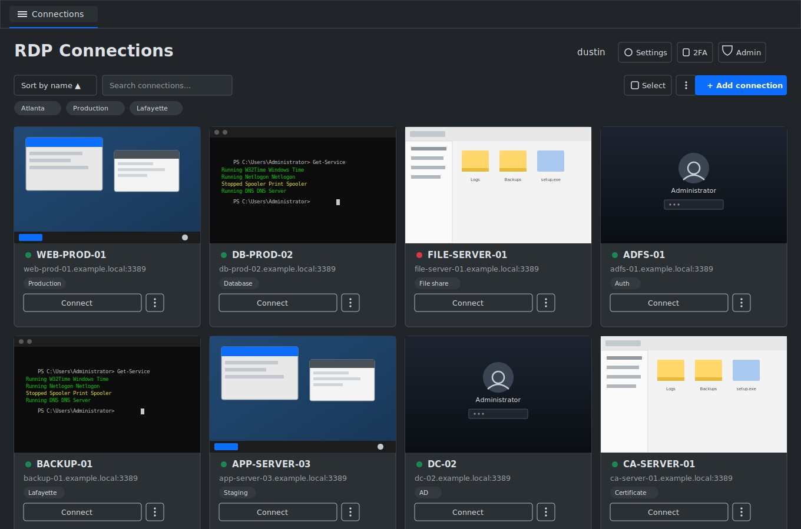

# RDP Web App

A minimal, self-hosted web app for opening RDP and SSH sessions from a
browser. List, add, and delete connections through a single-page UI;
click "Connect" to open a live session rendered in a `<canvas>`.

**Self-service accounts, no database** — anyone can register their own
account (just a username/password, no email), and each person's saved
connections are private to them. Both users and connections are stored in
flat JSON files rather than a database, and the entire frontend is one HTML
file (`public/index.html`) with inline CSS/JS.

## Screenshots

### Connections


## How it works

```
Browser  <--WebSocket-->  Node app (Express + guacamole-lite)  <--Guacamole protocol-->  guacd  <--RDP/SSH-->  target machine
```

- **guacd** is a small native daemon (from the Apache Guacamole project) that
  actually speaks RDP and SSH. There's no way around needing something like
  it — a browser can't open a raw RDP/SSH/TCP connection by itself, so
  something has to translate the protocol. We run it as an official
  prebuilt Docker container, so there's nothing to compile.
- **guacamole-lite** is a lightweight Node.js library that brokers the
  WebSocket connection between the browser and guacd.
- **Our own app** (Express + flat JSON files + one HTML file) handles
  login/registration, "list / add / delete connections" scoped per user, and
  asks guacamole-lite to open a session on demand.

## Requirements

- **Windows**: Docker Desktop — see the Windows section below
- **macOS / Linux**: Docker + the Docker Compose plugin (the setup script
  can install Docker for you on Debian/Ubuntu-based systems if missing)

## One-click setup — Windows

1. Double-click **`setup.bat`**. It'll prompt for administrator privileges
   (a normal UAC popup) — this is needed because the script checks for and
   automatically installs [Windows Subsystem for
   Linux](https://learn.microsoft.com/windows/wsl/) if it isn't already
   present, since Docker Desktop requires it regardless of which container
   backend (WSL2 or Hyper-V) you end up using.
2. If WSL had to be installed, the script will tell you to **restart your
   computer**, then run `setup.bat` again — this is a genuine Windows/WSL
   requirement, not something the script can skip.
3. If [Docker Desktop](https://www.docker.com/products/docker-desktop/)
   itself isn't installed, the script offers to install it via `winget`.
   Once it's installed, launch it and wait for the whale icon in the system
   tray to go steady (not animating) before running `setup.bat` again.

That script will:
1. Check for and install WSL if needed (see above)
2. Check Docker Desktop is installed and running (offers to install it via
   `winget` if missing)
3. Generate a `.env` file with random encryption keys
4. Build and start the containers (`guacd` + the web app)

Then open the URL it prints (default `https://localhost:8080`). Your browser
will show a security warning the first time — this is expected, since the
app uses a self-signed certificate generated automatically on first run
(see [HTTPS](docs/accounts-and-security.md#https) for why, and how to change this).

Day to day: double-click **`start.bat`** / **`stop.bat`** (these don't need
administrator rights, since WSL/Docker are already set up by that point).

If Windows blocks the `.bat` from running (SmartScreen), right-click →
Properties → check "Unblock", or run it from a terminal instead:
`powershell -ExecutionPolicy Bypass -File setup.ps1` (as Administrator, if
WSL still needs installing)

## One-click setup — macOS / Linux

```bash
./setup.sh
```

This will check for/offer to install Docker, generate a `.env` file with
random encryption keys, then build and start the containers.

Day-to-day: `./start.sh` / `./stop.sh`

## Using it

1. Open the app — first time, click **Register** and create a username/password (no email needed). You'll be logged in immediately (after setting up [two-factor authentication](docs/accounts-and-security.md#two-factor-authentication-required), which is required for every account).
2. Click **+ Add connection**, fill in hostname, port (default 3389 for RDP, 22 for SSH),
   domain (optional), username, and password.
3. Click **Connect** — it opens a new tab and switches to a live session.
4. Click into the session once to make sure it has keyboard focus.
5. Click **← Back to list** to keep the session running in the background and return to it later via its tab, or **Disconnect**/the tab's **×** to actually end it.

## Documentation

This README covers installation and the basics above. Everything else is
split out by topic:

- **[Session features](docs/session-features.md)** — command palette,
  screenshots, fullscreen, split view, tab reordering, clipboard/file
  transfer, themes
- **[Managing connections](docs/managing-connections.md)** — default
  credentials, notes/tags, bulk actions, Active Directory import, sharing,
  export/import
- **[Monitoring and admin tools](docs/monitoring-and-admin-tools.md)** —
  reachability checks, live hardware specs, and the read-only WinRM admin
  toolkit (Event Viewer, processes, services, and more)
- **[SSH connections](docs/ssh.md)** — protocol setup, password vs. private
  key authentication, clipboard behavior
- **[Accounts and security](docs/accounts-and-security.md)** — two-factor
  authentication, recovery codes, automatic sign-out, HTTPS, the full
  security notes, the admin panel, and roles/permissions
- **[Single sign-on (Microsoft Entra ID)](docs/sso.md)** — full setup walkthrough
- **[Deployment and maintenance](docs/deployment.md)** — project layout,
  customizing your deployment, shared drive uploads, backups, dependency
  updates
- **[Troubleshooting](docs/troubleshooting.md)**
